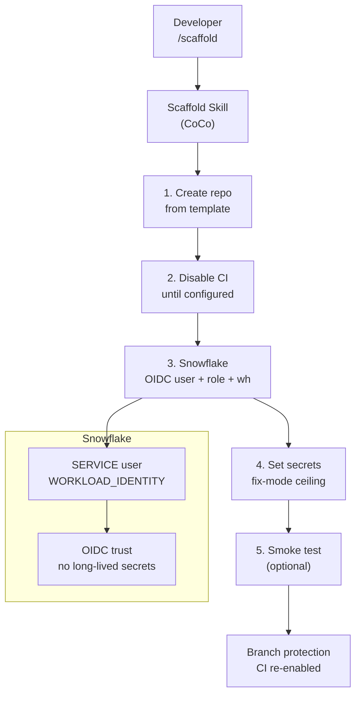

# Scaffold Overview

The scaffold skill walks through six steps to provision an Agentic DevOps pipeline on GitHub Actions or GitLab CI. Both platforms use the same security posture.

## Architecture



## Steps

| Step | File | Mode |
|------|------|------|
| 1. Create Project | `step-1-create-project.md` | both |
| 2. Hold Before Go-Live | `step-2-hold-before-golive.md` | both |
| 3. Connect Snowflake | `step-3-connect-snowflake.md` | both |
| 4. Configure | `step-4-configure.md` | both (routes by SETUP_MODE) |
| 5. Watch the Loop | `step-5-watch-loop.md` | full setup only |
| 6. Clean Up | `step-6-clean-up.md` | on demand |

## Naming convention

All Snowflake objects use a deterministic naming pattern:

```text
{PREFIX}_{GH|GL}_{REPO_NAME_NORM}_COCO_AGENT_{OBJECT}
```

Example with `PREFIX=DEMO`, repo `nimble-broker` on GitHub:

- Role: `DEMO_GH_NIMBLE_BROKER_COCO_AGENT_ROLE`
- Warehouse: `DEMO_GH_NIMBLE_BROKER_COCO_AGENT_WH`
- User: `DEMO_GH_NIMBLE_BROKER_COCO_AGENT_USER`

## Resume detection

Every run reads the manifest at `.coco-agent/manifest.toml`. If a manifest exists, the skill resumes from the first incomplete step. No need to restart after a crash or interruption.
