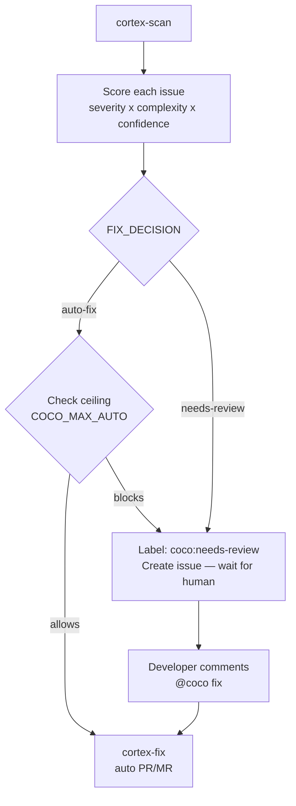

# Smart Fix Overview

The smart fix mode is the feature that makes CoCo unique among AI DevOps tools.
Instead of auto-fixing everything (or nothing), CoCo scores each finding and routes
it to either automatic fixing or human review based on a team-configured policy.

## How it works



## Fix mode resolution

The team controls the ceiling via config-as-code. An environment variable provides
a runtime override without requiring a PR:

```text
Priority (highest wins):
1. vars.COCO_MAX_AUTO        ← runtime experiment (no PR needed)
2. .github/coco-config.yml   ← team policy, auditable via git history
3. Built-in default: "conservative"
```

Every run logs the active ceiling and its source to the Actions/pipeline summary:

```text
::notice::Fix ceiling: conservative (source: .github/coco-config.yml)
```

## What makes this unique

Every other AI coding tool auto-fixes everything or nothing.
CoCo makes a per-issue judgment — and documents that judgment in the issue body:

```text
---
_Severity: HIGH | Complexity: LOW | Confidence: HIGH | Fix mode: auto_
```

When your auditor asks "what governed this AI fix?", you open `.github/coco-config.yml`
and show them the commit that set the policy. No other AI DevOps tool can say that.

See [Scoring](scoring.md), [Config Reference](config.md), and [Comment Trigger](comment-trigger.md)
for the full details.
