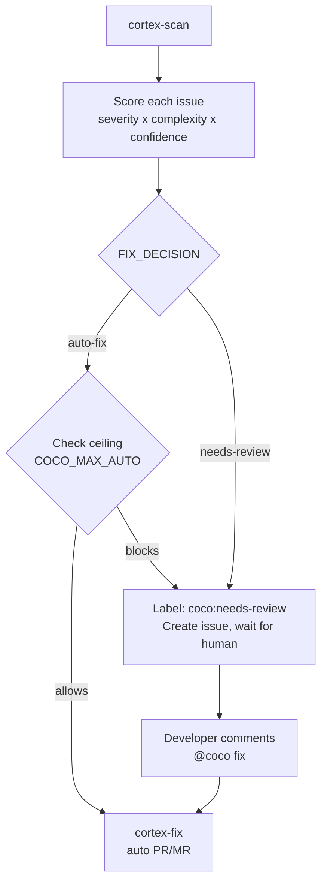

# Smart Fix

CoCo scores each finding and decides per-issue whether to auto-fix or route to human review, based on a team-configured policy.

## How it works



## Fix mode resolution

The team controls the ceiling via config-as-code. An environment variable provides
a runtime override without requiring a PR:

```text
Priority (highest wins):
1. vars.COCO_MAX_AUTO        -- runtime experiment, no PR needed
2. .github/coco-config.yml   -- team policy, auditable via git history
3. Built-in default: "conservative"
```

Every run logs the active ceiling and its source to the Actions/pipeline summary:

```text
::notice::Fix ceiling: conservative (source: .github/coco-config.yml)
```

## The key difference

Most AI coding tools treat every finding the same way: auto-fix everything, or do nothing. CoCo scores each finding before acting. The decision and its reasoning appear directly in the issue body:

> **Severity:** HIGH | **Complexity:** LOW | **Confidence:** HIGH | **Fix mode:** auto

When your auditor asks what governed an AI fix, you open `.github/coco-config.yml`
and show them the commit that set the policy.

See [Scoring](scoring.md), [Config Reference](config.md), and [Comment Trigger](comment-trigger.md)
for details.
